# dio-live-dynamodb
Repositório para o live coding do dia 30/09/2021 sobre o Amazon DynamoDB

### Serviço utilizado
  - Amazon DynamoDB
  - Amazon CLI para execução em linha de comando

### Comandos para execução do experimento:

- Criar tabela de filmes

```
aws dynamodb create-table \
    --table-name Movie \
    --attribute-definitions \
        AttributeName=MovieName,AttributeType=S \
        AttributeName=Director,AttributeType=S \
    --key-schema \
        AttributeName=MovieName,KeyType=HASH \
        AttributeName=Director,KeyType=RANGE \
    --provisioned-throughput \
        ReadCapacityUnits=10,WriteCapacityUnits=5
```

- Criar tabela com os gêneros dos filmes

```
aws dynamodb create-table \
    --table-name MovieGenre \
    --attribute-definitions \
        AttributeName=MovieName,AttributeType=S \
        AttributeName=Genre,AttributeType=S \
    --key-schema \
        AttributeName=MovieName,KeyType=HASH \
        AttributeName=Genre,KeyType=RANGE \
    --provisioned-throughput \
        ReadCapacityUnits=10,WriteCapacityUnits=5
```

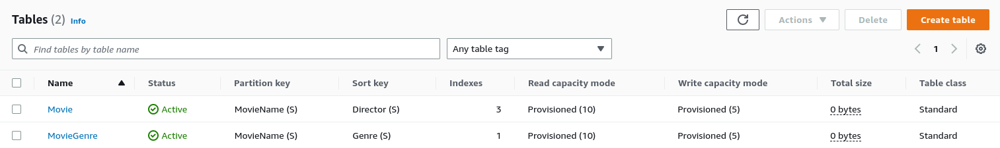

- Criar index global secundário baseado no diretor

```
aws dynamodb update-table \
    --table-name Movie \
    --attribute-definitions AttributeName=Director,AttributeType=S \
    --global-secondary-index-updates \
        "[{\"Create\":{\"IndexName\": \"Director-index\",\"KeySchema\":[{\"AttributeName\":\"Director\",\"KeyType\":\"HASH\"}], \
        \"ProvisionedThroughput\": {\"ReadCapacityUnits\": 10, \"WriteCapacityUnits\": 5      },\"Projection\":{\"ProjectionType\":\"ALL\"}}}]"
```

- Criar index global secundário baseado no ano de lançamento

```
aws dynamodb update-table \
    --table-name Movie \
    --attribute-definitions AttributeName=ReleaseYear,AttributeType=N \
    --global-secondary-index-updates \
        "[{\"Create\":{\"IndexName\": \"ReleaseYear-index\",\"KeySchema\":[{\"AttributeName\":\"ReleaseYear\",\"KeyType\":\"HASH\"}], \
        \"ProvisionedThroughput\": {\"ReadCapacityUnits\": 10, \"WriteCapacityUnits\": 5      },\"Projection\":{\"ProjectionType\":\"ALL\"}}}]"
```

- Criar index global secundário baseado no diretor e no ano de lançamento

```
aws dynamodb update-table \
    --table-name Movie \
    --attribute-definitions\
        AttributeName=Director,AttributeType=S \
        AttributeName=ReleaseYear,AttributeType=N \
    --global-secondary-index-updates \
        "[{\"Create\":{\"IndexName\": \"DirectorReleaseYear-index\",\"KeySchema\":[{\"AttributeName\":\"Director\",\"KeyType\":\"HASH\"}, {\"AttributeName\": \"ReleaseYear\", \"KeyType\": \"RANGE\"}], \
        \"ProvisionedThroughput\": {\"ReadCapacityUnits\": 10, \"WriteCapacityUnits\": 5      },\"Projection\":{\"ProjectionType\":\"ALL\"}}}]"
```

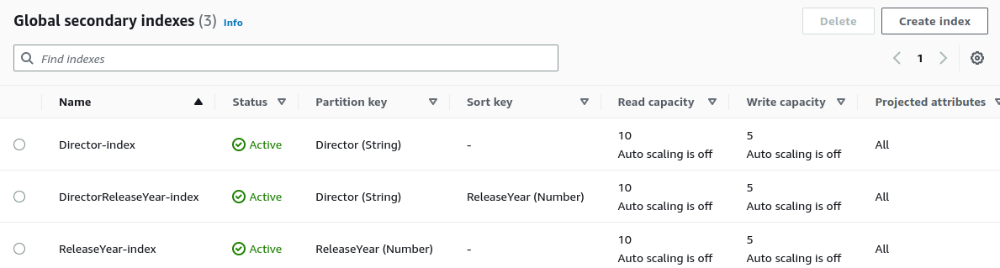

- Criar index global secundário baseado no gênero

```
aws dynamodb update-table \
    --table-name MovieGenre \
    --attribute-definitions AttributeName=Genre,AttributeType=S \
    --global-secondary-index-updates \
        "[{\"Create\":{\"IndexName\": \"Genre-index\",\"KeySchema\":[{\"AttributeName\":\"Genre\",\"KeyType\":\"HASH\"}], \
        \"ProvisionedThroughput\": {\"ReadCapacityUnits\": 10, \"WriteCapacityUnits\": 5      },\"Projection\":{\"ProjectionType\":\"ALL\"}}}]"
```

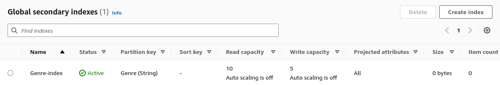

- Inserir um item na tabela Movie

```
    aws dynamodb put-item \
        --table-name Movie \
        --item file://src/itemmovie.json \
```

- Inserir os gêneros do último filme adicionado

```
aws dynamodb batch-write-item \
    --request-items file://src/itemmoviegenre.json \
```

- Inserir múltiplos itens

```
aws dynamodb batch-write-item \
    --request-items file://src/batchmovie.json \
```

- Inserir os gêneros dos últimos filmes adicionados

```
aws dynamodb batch-write-item \
    --request-items file://src/batchmoviegenre.json \
```

#### Movie:

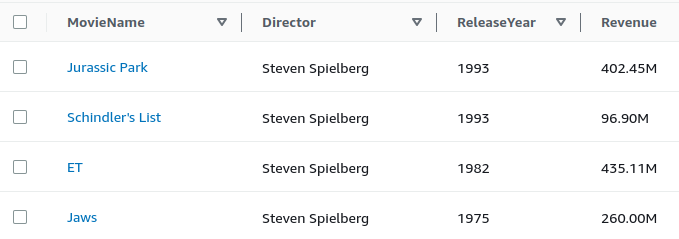

#### MovieGenre:

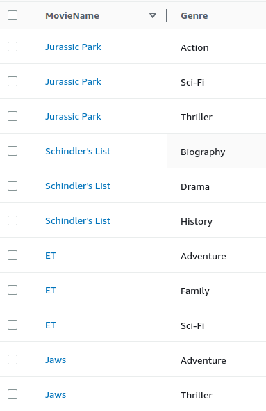

- Pesquisar filme por nome

```
aws dynamodb query \
    --table-name Movie \
    --key-condition-expression "MovieName = :name" \
    --expression-attribute-values  '{":name":{"S":"Jaws"}}'
```

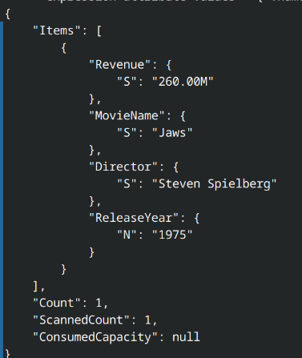

- Pesquisar gêneros de filme por nome

```
aws dynamodb query \
    --table-name MovieGenre \
    --key-condition-expression "MovieName = :name" \
    --expression-attribute-values  '{":name":{"S":"Jaws"}}'
```

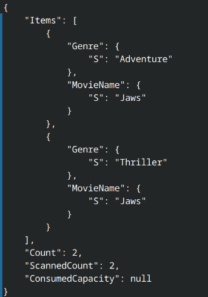

- Pesquisa pelo index secundário baseado no diretor

```
aws dynamodb query \
    --table-name Movie \
    --index-name Director-index \
    --key-condition-expression "Director = :director" \
    --expression-attribute-values  '{":director":{"S":"Steven Spielberg"}}'
```

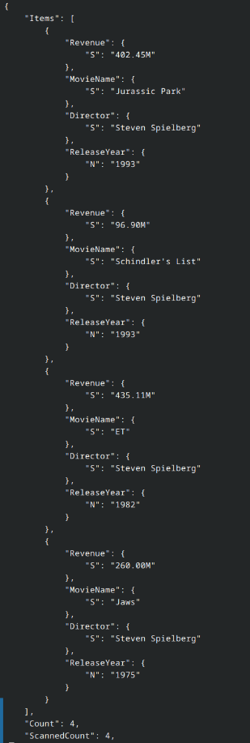

- Pesquisa pelo index secundário baseado no ano de lançamento

```
aws dynamodb query \
    --table-name Movie \
    --index-name ReleaseYear-index \
    --key-condition-expression "ReleaseYear = :year" \
    --expression-attribute-values  '{":year":{"N":"1993"}}'
```

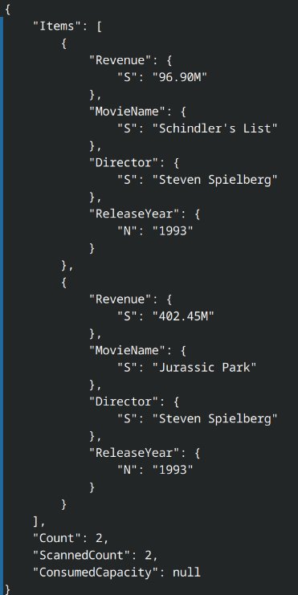

- Pesquisa pelo index secundário baseado no diretor e ano de lançamento

```
aws dynamodb query \
    --table-name Movie \
    --index-name DirectorReleaseYear-index \
    --key-condition-expression "Director = :director and ReleaseYear = :year" \
    --expression-attribute-values  '{":director":{"S":"Steven Spielberg"},":year":{"N":"1993"} }'
```

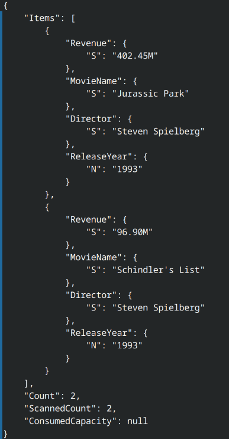

- Pesquisa pelo index secundário baseado no gênero

```
aws dynamodb query \
    --table-name MovieGenre \
    --index-name Genre-index \
    --key-condition-expression "Genre = :genre" \
    --expression-attribute-values  '{":genre":{"S":"Sci-fi"}}'
```

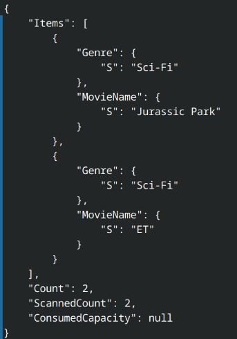
